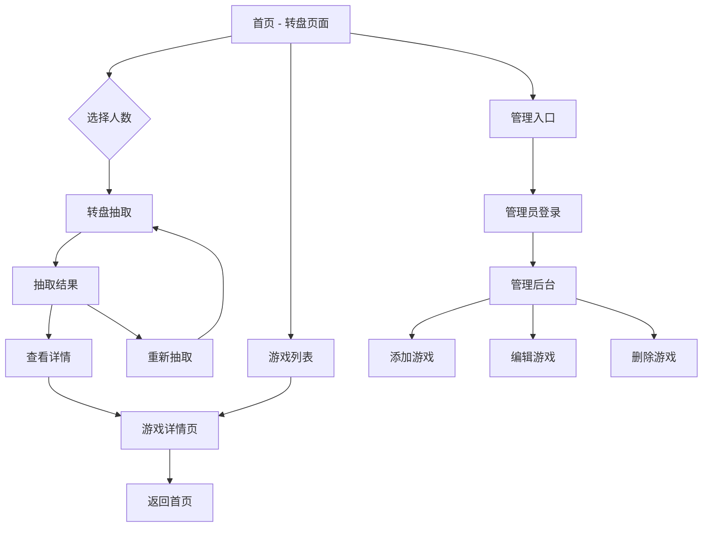
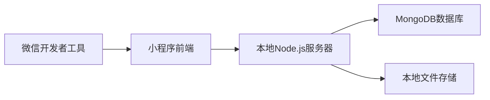

# 游戏抽取小程序 - 架构设计方案

## 项目概述

**项目名称**: 今天玩什么

**核心功能**: 
- 转盘抽取游戏
- 根据人数筛选游戏
- 查看游戏详情（文字、图片、视频）
- 管理后台添加/编辑游戏

**技术栈**:
- 前端：微信小程序原生开发
- 本地测试：Node.js + Express + MongoDB

---

## 一、UI/UX 交互设计

### 1.1 主要页面流程



### 1.2 游戏抽取动画设计
- 多张游戏卡片从右向左快速滑动
- 卡片逐渐减速，最终停在选中的游戏上
- 中心的卡片最大最清晰，两侧的卡片缩小且半透明，且与中心卡片重叠百分之70
- 左右两侧有渐变遮罩，营造景深效果
- 流畅的缓动动画，持续3.5秒

### 1.3 页面结构

#### 首页（抽取页）
- 顶部：人数筛选器（2人、3-4人、5-8人、8人以上、不限）
- 中间：抽取区域
- 底部：
  - 暂时没规划

#### 游戏详情页
- 游戏名称
- 适合人数标签
- 游戏封面图
- 文字描述
- 图片轮播（如有）
- 视频播放器（如有）
- 底部操作：
  - "再抽一次"
  - "分享"

#### 游戏列表页
- 顶部：人数筛选 + 搜索框
- 列表：卡片式展示
  - 游戏名称
  - 人数标签
  - 封面缩略图

#### 管理后台
- 游戏列表（可编辑/删除）
- 添加游戏表单：
  - 游戏名称
  - 适合人数（多选）
  - 游戏描述
  - 上传封面图
  - 上传详情图片（多张）
  - 上传视频

---

## 二、数据结构设计

### 2.1 游戏数据模型

```javascript
{
  _id: "game_001",
  name: "狼人杀",
  description: "经典的角色扮演推理游戏...",
  playerCount: {
    min: 6,
    max: 18,
    optimal: [8, 9, 10, 11, 12]  // 最佳人数
  },
  tags: ["推理", "角色扮演", "语言"],
  coverImage: "cloud://xxx.png",  // 封面图
  images: [                        // 详情图片
    "cloud://xxx1.jpg",
    "cloud://xxx2.jpg"
  ],
  videos: [                        // 教学视频
    {
      url: "cloud://xxx.mp4",
      title: "基础规则讲解",
      duration: 180  // 秒
    }
  ],
  difficulty: "medium",            // easy/medium/hard
  duration: 30,                    // 游戏时长（分钟）
  createdAt: "2026-02-01T14:00:00Z",
  updatedAt: "2026-02-01T14:00:00Z",
  status: "active"                 // active/inactive
}
```

### 2.2 管理员数据模型

```javascript
{
  _id: "admin_001",
  openid: "oXXXXXXXXXXXXXXX",     // 微信openid
  nickname: "管理员",
  role: "admin",
  createdAt: "2026-02-01T14:00:00Z"
}
```

---

## 三、技术架构

### 3.1 本地测试环境架构



**本地服务器技术栈**:
- Node.js + Express
- MongoDB（数据库）
- Multer（文件上传）
- JWT（管理员认证）

## 四、项目文件结构

```
今天玩什么/
├── miniprogram/                 # 小程序前端
│   ├── pages/
│   │   ├── index/              # 首页（转盘）
│   │   │   ├── index.js
│   │   │   ├── index.json
│   │   │   ├── index.wxml
│   │   │   └── index.wxss
│   │   ├── detail/             # 游戏详情页
│   │   │   ├── detail.js
│   │   │   ├── detail.json
│   │   │   ├── detail.wxml
│   │   │   └── detail.wxss
│   │   ├── list/               # 游戏列表页
│   │   │   ├── list.js
│   │   │   ├── list.json
│   │   │   ├── list.wxml
│   │   │   └── list.wxss
│   │   ├── admin/              # 管理后台
│   │   │   ├── login/          # 登录页
│   │   │   ├── manage/         # 游戏管理列表
│   │   │   └── edit/           # 添加/编辑游戏
│   │   └── ...
│   ├── components/             # 自定义组件
│   │   ├── wheel/              # 转盘组件
│   │   ├── game-card/          # 游戏卡片组件
│   │   └── player-selector/    # 人数选择器组件
│   ├── utils/                  # 工具函数
│   │   ├── api.js              # API封装
│   │   ├── auth.js             # 认证相关
│   │   └── util.js             # 通用工具
│   ├── images/                 # 静态图片资源
│   ├── app.js                  # 小程序入口
│   ├── app.json                # 小程序配置
│   └── app.wxss                # 全局样式
│
│
├── server/                     # 本地测试服务器
│   ├── src/
│   │   ├── routes/
│   │   │   ├── games.js        # 游戏相关路由
│   │   │   ├── admin.js        # 管理员路由
│   │   │   └── upload.js       # 文件上传路由
│   │   ├── models/
│   │   │   ├── Game.js         # 游戏模型
│   │   │   └── Admin.js        # 管理员模型
│   │   ├── middleware/
│   │   │   └── auth.js         # 认证中间件
│   │   ├── config/
│   │   │   └── db.js           # 数据库配置
│   │   └── app.js              # Express应用入口
│   ├── uploads/                # 本地上传文件存储
│   ├── package.json
│   └── .env                    # 环境变量配置
│
├── docs/                       # 文档
│   └── API.md                  # API接口文档
│
└── project.config.json         # 小程序项目配置
```

---

## 五、核心功能实现要点

### 5.1 转盘抽取算法

### 5.3 文件上传处理

**本地环境**:
- 使用 `wx.uploadFile()` 上传到本地服务器
- Multer中间件处理文件存储
- 返回本地文件URL

### 5.4 管理员权限控制

**方案**: 基于微信openid的白名单机制

1. 首次登录时获取用户openid
2. 检查openid是否在管理员白名单中
3. 如果是管理员，生成token并存储
4. 后续请求携带token验证权限

---

## 六、开发阶段规划

### 阶段一：前端页面与管理员页面

### 阶段二：中间件

### 阶段三：后端

---

## 八、API接口设计

### 8.1 游戏相关接口

| 接口 | 方法 | 说明 | 权限 |
|------|------|------|------|
| `/api/games` | GET | 获取游戏列表 | 公开 |
| `/api/games/:id` | GET | 获取游戏详情 | 公开 |
| `/api/games` | POST | 添加游戏 | 管理员 |
| `/api/games/:id` | PUT | 更新游戏 | 管理员 |
| `/api/games/:id` | DELETE | 删除游戏 | 管理员 |
| `/api/games/random` | GET | 随机抽取游戏 | 公开 |

### 8.2 文件上传接口

| 接口 | 方法 | 说明 | 权限 |
|------|------|------|------|
| `/api/upload/image` | POST | 上传图片 | 管理员 |
| `/api/upload/video` | POST | 上传视频 | 管理员 |

### 8.3 管理员接口

| 接口 | 方法 | 说明 | 权限 |
|------|------|------|------|
| `/api/admin/login` | POST | 管理员登录 | 公开 |
| `/api/admin/check` | GET | 验证管理员身份 | 管理员 |

---

## 十、后续扩展功能

1. **社交功能**
   - 分享游戏到微信好友/群
   - 查看好友玩过的游戏

2. **个性化推荐**
   - 根据历史记录推荐游戏
   - 收藏喜欢的游戏

3. **游戏评分**
   - 用户可以给游戏评分
   - 显示游戏热度排行

4. **多语言支持**
   - 支持中英文切换

5. **主题切换**
   - 日间/夜间模式

---

## 总结

这是一个功能完整、架构清晰的微信小程序项目。通过本地测试环境快速迭代，然后平滑迁移到云开发，可以有效降低开发成本和部署难度。

**关键优势**:
- ✅ 完全遵守微信小程序语法规范
- ✅ 支持本地测试和云端部署
- ✅ 数据结构灵活，易于扩展
- ✅ 管理后台方便内容更新
- ✅ 用户体验流畅有趣

