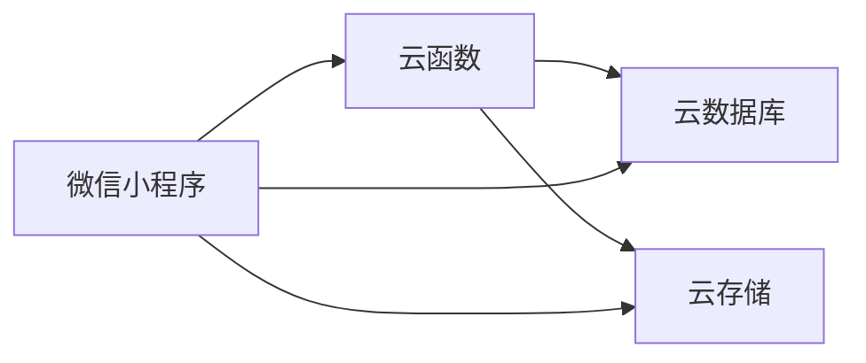

# 游戏抽取小程序 - 架构设计方案

## 项目概述

**项目名称**: 今天玩什么（游戏抽取小程序）

**核心功能**: 
- 转盘抽取游戏
- 根据人数筛选游戏
- 查看游戏详情（文字、图片、视频）
- 管理后台添加/编辑游戏

**技术栈**:
- 前端：微信小程序原生开发
- 本地测试：Node.js + Express + MongoDB
- 生产环境：微信云开发（CloudBase）

---

## 一、UI/UX 交互设计

### 1.1 主要页面流程


### 1.2 转盘设计建议

**方案A: 3D转盘（推荐）**
- 视觉效果更好，更有仪式感
- 使用 Canvas 2D API 绘制伪3D效果
- 支持触摸滑动和自动旋转

**方案B: 2D转盘**
- 实现简单，性能更好
- 适合游戏数量较多的场景

**方案C: 卡片翻转**
- 备选方案：多张卡片随机翻转
- 适合游戏数量少的场景

**建议**: 先实现方案B（2D转盘），后期可优化为方案A

### 1.3 页面结构

#### 首页（转盘页）
- 顶部：人数筛选器（2人、3-4人、5-8人、8人以上、不限）
- 中间：转盘区域
- 底部：
  - "开始抽取"按钮
  - "游戏列表"入口
  - "管理"入口（需登录）

#### 游戏详情页
- 游戏名称
- 适合人数标签
- 游戏封面图
- 文字描述
- 图片轮播（如有）
- 视频播放器（如有）
- 底部操作：
  - "再抽一次"
  - "分享"

#### 游戏列表页
- 顶部：人数筛选 + 搜索框
- 列表：卡片式展示
  - 游戏名称
  - 人数标签
  - 封面缩略图

#### 管理后台
- 游戏列表（可编辑/删除）
- 添加游戏表单：
  - 游戏名称
  - 适合人数（多选）
  - 游戏描述
  - 上传封面图
  - 上传详情图片（多张）
  - 上传视频

---

## 二、数据结构设计

### 2.1 游戏数据模型

```javascript
{
  _id: "game_001",
  name: "狼人杀",
  description: "经典的角色扮演推理游戏...",
  playerCount: {
    min: 6,
    max: 18,
    optimal: [8, 9, 10, 11, 12]  // 最佳人数
  },
  tags: ["推理", "角色扮演", "语言"],
  coverImage: "cloud://xxx.png",  // 封面图
  images: [                        // 详情图片
    "cloud://xxx1.jpg",
    "cloud://xxx2.jpg"
  ],
  videos: [                        // 教学视频
    {
      url: "cloud://xxx.mp4",
      title: "基础规则讲解",
      duration: 180  // 秒
    }
  ],
  difficulty: "medium",            // easy/medium/hard
  duration: 30,                    // 游戏时长（分钟）
  createdAt: "2026-02-01T14:00:00Z",
  updatedAt: "2026-02-01T14:00:00Z",
  status: "active"                 // active/inactive
}
```

### 2.2 管理员数据模型

```javascript
{
  _id: "admin_001",
  openid: "oXXXXXXXXXXXXXXX",     // 微信openid
  nickname: "管理员",
  role: "admin",
  createdAt: "2026-02-01T14:00:00Z"
}
```

### 2.3 抽取历史（可选）

```javascript
{
  _id: "history_001",
  openid: "oXXXXXXXXXXXXXXX",
  gameId: "game_001",
  playerCount: 8,
  timestamp: "2026-02-01T14:30:00Z"
}
```

---

## 三、技术架构

### 3.1 本地测试环境架构


**本地服务器技术栈**:
- Node.js + Express
- MongoDB（数据库）
- Multer（文件上传）
- JWT（管理员认证）

### 3.2 生产环境架构（微信云开发）



**云开发服务**:
- 云数据库：存储游戏数据、管理员信息
- 云存储：存储图片、视频文件
- 云函数：处理复杂业务逻辑（如管理员权限验证）

### 3.3 数据迁移策略

本地测试 → 云开发的迁移：
1. 导出本地MongoDB数据为JSON
2. 通过云开发控制台导入数据
3. 上传本地文件到云存储
4. 更新数据库中的文件URL

---

## 四、项目文件结构

```
今天玩什么/
├── miniprogram/                 # 小程序前端
│   ├── pages/
│   │   ├── index/              # 首页（转盘）
│   │   │   ├── index.js
│   │   │   ├── index.json
│   │   │   ├── index.wxml
│   │   │   └── index.wxss
│   │   ├── detail/             # 游戏详情页
│   │   │   ├── detail.js
│   │   │   ├── detail.json
│   │   │   ├── detail.wxml
│   │   │   └── detail.wxss
│   │   ├── list/               # 游戏列表页
│   │   │   ├── list.js
│   │   │   ├── list.json
│   │   │   ├── list.wxml
│   │   │   └── list.wxss
│   │   ├── admin/              # 管理后台
│   │   │   ├── login/          # 登录页
│   │   │   ├── manage/         # 游戏管理列表
│   │   │   └── edit/           # 添加/编辑游戏
│   │   └── ...
│   ├── components/             # 自定义组件
│   │   ├── wheel/              # 转盘组件
│   │   ├── game-card/          # 游戏卡片组件
│   │   └── player-selector/    # 人数选择器组件
│   ├── utils/                  # 工具函数
│   │   ├── api.js              # API封装
│   │   ├── auth.js             # 认证相关
│   │   └── util.js             # 通用工具
│   ├── images/                 # 静态图片资源
│   ├── app.js                  # 小程序入口
│   ├── app.json                # 小程序配置
│   └── app.wxss                # 全局样式
│
├── cloudfunctions/             # 云函数（生产环境）
│   ├── getGames/               # 获取游戏列表
│   ├── addGame/                # 添加游戏
│   ├── updateGame/             # 更新游戏
│   ├── deleteGame/             # 删除游戏
│   └── checkAdmin/             # 验证管理员权限
│
├── server/                     # 本地测试服务器
│   ├── src/
│   │   ├── routes/
│   │   │   ├── games.js        # 游戏相关路由
│   │   │   ├── admin.js        # 管理员路由
│   │   │   └── upload.js       # 文件上传路由
│   │   ├── models/
│   │   │   ├── Game.js         # 游戏模型
│   │   │   └── Admin.js        # 管理员模型
│   │   ├── middleware/
│   │   │   └── auth.js         # 认证中间件
│   │   ├── config/
│   │   │   └── db.js           # 数据库配置
│   │   └── app.js              # Express应用入口
│   ├── uploads/                # 本地上传文件存储
│   ├── package.json
│   └── .env                    # 环境变量配置
│
├── docs/                       # 文档
│   └── API.md                  # API接口文档
│
└── project.config.json         # 小程序项目配置
```

---

## 五、核心功能实现要点

### 5.1 转盘抽取算法

```javascript
// 伪代码
function spinWheel(games, playerCount) {
  // 1. 根据人数筛选游戏
  const filteredGames = games.filter(game => {
    return playerCount >= game.playerCount.min && 
           playerCount <= game.playerCount.max;
  });
  
  // 2. 随机选择
  const randomIndex = Math.floor(Math.random() * filteredGames.length);
  
  // 3. 计算转盘旋转角度（增加动画效果）
  const baseRotation = 360 * 5; // 至少转5圈
  const targetAngle = (360 / filteredGames.length) * randomIndex;
  const finalRotation = baseRotation + targetAngle;
  
  return {
    game: filteredGames[randomIndex],
    rotation: finalRotation
  };
}
```

### 5.2 转盘Canvas绘制

- 使用 `wx.createCanvasContext()` 创建画布
- 绘制扇形区域（每个游戏占一个扇形）
- 添加游戏名称文字
- 实现旋转动画（使用 `requestAnimationFrame`）

### 5.3 文件上传处理

**本地环境**:
- 使用 `wx.uploadFile()` 上传到本地服务器
- Multer中间件处理文件存储
- 返回本地文件URL

**云开发环境**:
- 使用 `wx.cloud.uploadFile()` 上传到云存储
- 返回云文件ID（`cloud://xxx`）

### 5.4 管理员权限控制

**方案**: 基于微信openid的白名单机制

1. 首次登录时获取用户openid
2. 检查openid是否在管理员白名单中
3. 如果是管理员，生成token并存储
4. 后续请求携带token验证权限

---

## 六、开发阶段规划

### 阶段一：本地环境搭建
1. 初始化微信小程序项目
2. 搭建本地Node.js服务器
3. 配置MongoDB数据库
4. 实现基础API接口

### 阶段二：核心功能开发
1. 实现转盘组件和抽取逻辑
2. 实现游戏详情页
3. 实现游戏列表页
4. 实现人数筛选功能

### 阶段三：管理后台开发
1. 实现管理员登录
2. 实现游戏添加功能
3. 实现游戏编辑功能
4. 实现文件上传功能

### 阶段四：云开发迁移
1. 开通微信云开发
2. 创建云函数
3. 迁移数据到云数据库
4. 迁移文件到云存储
5. 切换API调用方式

### 阶段五：优化和发布
1. 性能优化
2. UI/UX优化
3. 测试和bug修复
4. 提交审核和发布

---

## 七、技术难点和解决方案

### 7.1 转盘性能优化

**问题**: 游戏数量多时，Canvas绘制可能卡顿

**解决方案**:
- 使用离屏Canvas预渲染
- 限制转盘最多显示20个游戏
- 超过20个时随机选择20个展示

### 7.2 视频文件大小限制

**问题**: 微信小程序对文件大小有限制

**解决方案**:
- 限制单个视频不超过50MB
- 建议使用外链视频（如腾讯视频）
- 提供视频压缩指南

### 7.3 数据同步

**问题**: 本地环境和云环境数据不一致

**解决方案**:
- 使用统一的数据模型
- 提供数据导入/导出工具
- 编写迁移脚本

### 7.4 管理员权限安全

**问题**: 防止非管理员访问管理功能

**解决方案**:
- 前端隐藏管理入口（非管理员不显示）
- 后端/云函数强制验证权限
- 使用云函数进行敏感操作

---

## 八、API接口设计

### 8.1 游戏相关接口

| 接口 | 方法 | 说明 | 权限 |
|------|------|------|------|
| `/api/games` | GET | 获取游戏列表 | 公开 |
| `/api/games/:id` | GET | 获取游戏详情 | 公开 |
| `/api/games` | POST | 添加游戏 | 管理员 |
| `/api/games/:id` | PUT | 更新游戏 | 管理员 |
| `/api/games/:id` | DELETE | 删除游戏 | 管理员 |
| `/api/games/random` | GET | 随机抽取游戏 | 公开 |

### 8.2 文件上传接口

| 接口 | 方法 | 说明 | 权限 |
|------|------|------|------|
| `/api/upload/image` | POST | 上传图片 | 管理员 |
| `/api/upload/video` | POST | 上传视频 | 管理员 |

### 8.3 管理员接口

| 接口 | 方法 | 说明 | 权限 |
|------|------|------|------|
| `/api/admin/login` | POST | 管理员登录 | 公开 |
| `/api/admin/check` | GET | 验证管理员身份 | 管理员 |

---

## 九、UI设计建议

### 9.1 色彩方案

- 主色调：活力橙 `#FF6B35` 或 欢乐黄 `#FFD23F`
- 辅助色：天空蓝 `#3BCEAC`
- 背景色：浅灰 `#F5F5F5`
- 文字色：深灰 `#333333`

### 9.2 字体

- 标题：加粗，18-20px
- 正文：常规，14-16px
- 辅助信息：12px

### 9.3 动画效果

- 转盘旋转：缓动函数 `ease-out`，持续3-5秒
- 页面切换：淡入淡出
- 按钮点击：缩放反馈

---

## 十、后续扩展功能

1. **社交功能**
   - 分享游戏到微信好友/群
   - 查看好友玩过的游戏

2. **个性化推荐**
   - 根据历史记录推荐游戏
   - 收藏喜欢的游戏

3. **游戏评分**
   - 用户可以给游戏评分
   - 显示游戏热度排行

4. **多语言支持**
   - 支持中英文切换

5. **主题切换**
   - 日间/夜间模式

---

## 总结

这是一个功能完整、架构清晰的微信小程序项目。通过本地测试环境快速迭代，然后平滑迁移到云开发，可以有效降低开发成本和部署难度。

**关键优势**:
- ✅ 完全遵守微信小程序语法规范
- ✅ 支持本地测试和云端部署
- ✅ 数据结构灵活，易于扩展
- ✅ 管理后台方便内容更新
- ✅ 用户体验流畅有趣

**下一步**: 开始实施开发计划
